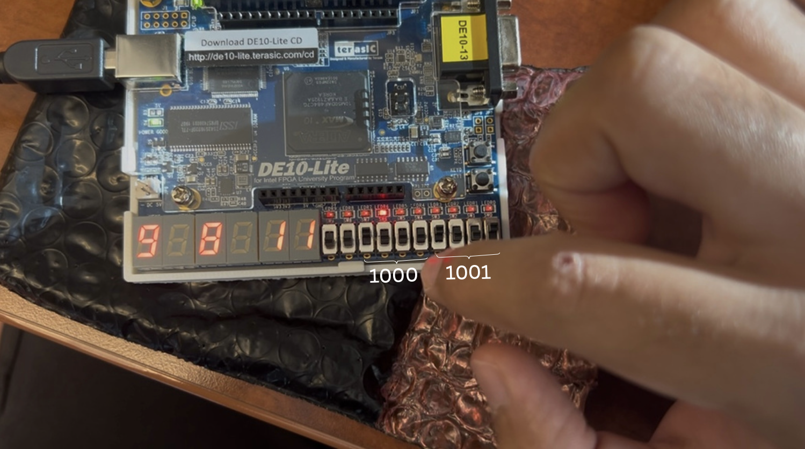

# ⚙️ FPGA Arithmetic Calculator – Verilog on DE10-Lite

A **4-bit arithmetic calculator** implemented in **Verilog** and deployed on the **Intel DE10-Lite FPGA**.  
This project performs **addition** and **two’s-complement subtraction**, displaying results on the **seven-segment LED displays**.  
User inputs are controlled using **on-board switches**, and the result updates in real time based on selected mode.

---

## 🎯 Objective

To design and implement a **basic arithmetic logic unit (ALU)** capable of:
- Performing **4-bit addition** and **subtraction**
- Demonstrating **two’s-complement subtraction logic**
- Displaying inputs and results using **seven-segment displays**
- Operating entirely on **FPGA hardware switches and LEDs**

---

## 🔩 Features

- 4-bit **binary arithmetic** in Verilog  
- **Mode control switch** toggles between addition and subtraction  
- Real-time output display on FPGA’s **seven-segment LEDs**  
- Clean hardware-only execution — no microcontroller required  
- Developed and tested on **Intel Quartus Prime Lite** with **DE10-Lite**

---

## 🧠 Hardware Used

| Component | Description |
|------------|-------------|
| **DE10-Lite FPGA Board** | Intel MAX-10 based FPGA development board |
| **Seven-Segment Displays** | Used to display operands and arithmetic results |
| **On-board Switches (SW0–SW9)** | Input binary values and select operation mode |
| **LEDR Indicators** | Show input bits and active mode |
| **Quartus Prime Lite Software** | For HDL design, synthesis, and FPGA programming |

---

## 🧰 FPGA Demonstration

Below are annotated images showing the **DE10-Lite FPGA board** executing 4-bit arithmetic operations.  
The calculator performs both **addition** and **two’s-complement subtraction**, with inputs entered through **switches (SW)** and results shown on **seven-segment displays**.

  
   
  <em>Figure 1: Initial setup — 0 + 0 = 0 (Binary: 0000 + 0000)</em>

  
   
  <em>Figure 2: Addition — 1 + 3 = 4 (Binary: 0001 + 0011)</em>

  
   
  <em>Figure 3: Subtraction — 5 − 7 = −2 (Binary: 0101 − 0111)</em>

  
   
  <em>Figure 4: Subtraction — 8 − 6 = 2 (Binary: 1000 − 0110, subtraction mode ON)</em>

  
   
  <em>Figure 5: Addition — 9 + 8 = B (Hexadecimal: 1001 + 1000 = 1011)</em>

---

## 🧑‍💻 Author

**Shivam Gupta**  
💼 [LinkedIn](https://www.linkedin.com/in/shivammmmg)  
💻 [GitHub](https://github.com/shivammmmg)

---

## 🏁 Summary

This FPGA project showcases a compact **hardware arithmetic calculator** built purely with **digital logic** in Verilog.  
It demonstrates **switch-based input**, **binary operations**, and **real-time hardware display** — a strong foundation for building full ALU designs.

